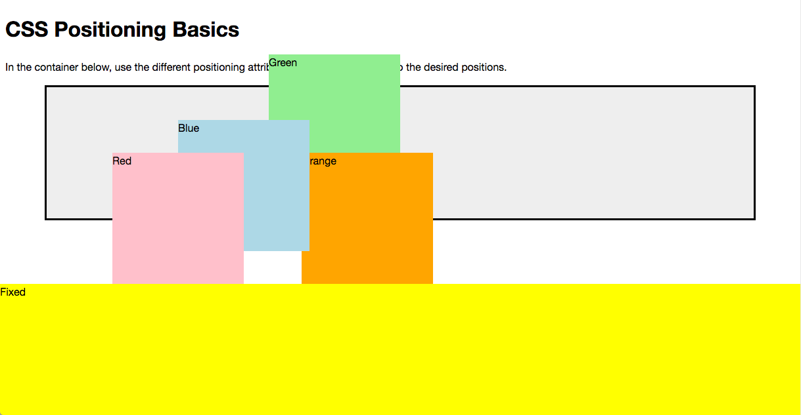
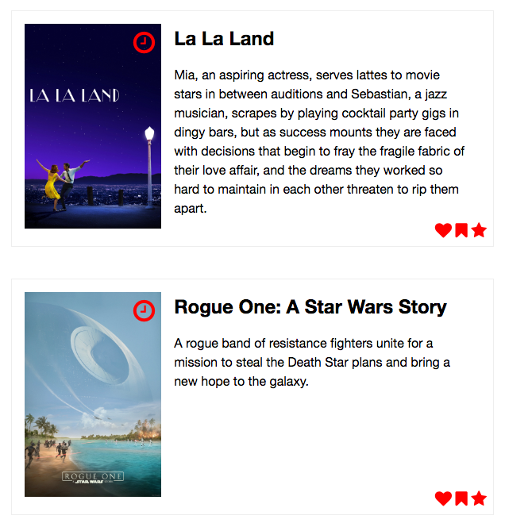

# CSS Positioning & Intro to Sass

This assignment is broken into three parts. After doing this assignment, you should have an understanding of:

- The use of `position` and related CSS properties
- Basic Sass features
  - variables
  - partials & imports
  - nesting
  - using mixins

## Part 1: Positioning Basics
In the first part we'll just play around with some basic positioning rules to ensure that we understand the fundamentals.

The goal is to make your final version look like mine:

### Tasks
1. Make all the positioning for the boxes relative to the div with class `container`
2. Set the position of the `.blue` box to be `50px` down and `200px` to the right of it's static (original) position
3. Position the `.red` box absolutely `50px` from the top and `100px` from the right of its container
4. Position the `.green` box absolutely `50px` from the bottom and `50%` from the right of its container
5. Position the `.orange` box absolutely `75%` from the top and `25%` from the left of its container
6. Fix the `.yellow` box to the bottom of the window. Make sure it starts at the left side and spans the entire width of the page, and that it stays there when you scroll the page.
7. Ensure that the blue box remains on top of all of the other boxes (this is where `z-index` comes in!)

## Part 2: Positioning in Practice
In this part, you'll be creating film cards with actions that should be specifically positioned. This will require you to use the display and float skills you learned, as well as the `position` property from today.

### Tasks
Here's the final version you're trying to recreate:

The plan is to make yours look as close to the final version as possible. The key features are:

- The watch later (clock) icon is positioned at the top right of the poster
  - I set mine `8px` down and `8px` from the right, but you can choose whatever looks best to you!
- The action icons (bookmark, heart and star) are positioned at the bottom right of the card
  - I set mine `8px` up and `8px` from the right, but you can choose whatever looks best to you!

## Part 3: Introduction to Sass
In this part you'll take an existing stylesheet and use the power of Sass to make it more readable and maintainable.

You'll find a simple Rails app in the `part-3` folder. This app has one controller and one view (`films#index`). The `index.html.erb` has the markup for the page and `app/assets/stylesheets/films.scss` has the existing styles.

You'll find a lot of help in the [Sass Documentation](http://sass-lang.com/documentation/file.SASS_REFERENCE.html)!

### Tasks
1. Move all of the `color` and `font-family` values into Sass variables at the top of `films.scss`
2. Refactor any repeated selectors into nested selectors
3. Use the provided `clearfix` mixin (with the `@include` syntax) instead of the `overflow` property in all places where it's being used to clear floated child elements
3. Split the styles into five (5) partials:
  - `_variables.scss` for all of the variables you defined in step 1
  - `_mixins.scss` for the clearfix mixin (and any others you invent!)
  - `_base.scss` for the basic tag level selectors
  - `_hero.scss` for all the styles related to the hero block
  - `_article.scss` for all the styles related to the article
    **Your `films.scss` should be empty by the end of this step!**
4. Import (using `@import`) your partials into `films.scss`
5. Make sure it still looks exactly the same!
6. Now make it your own!
